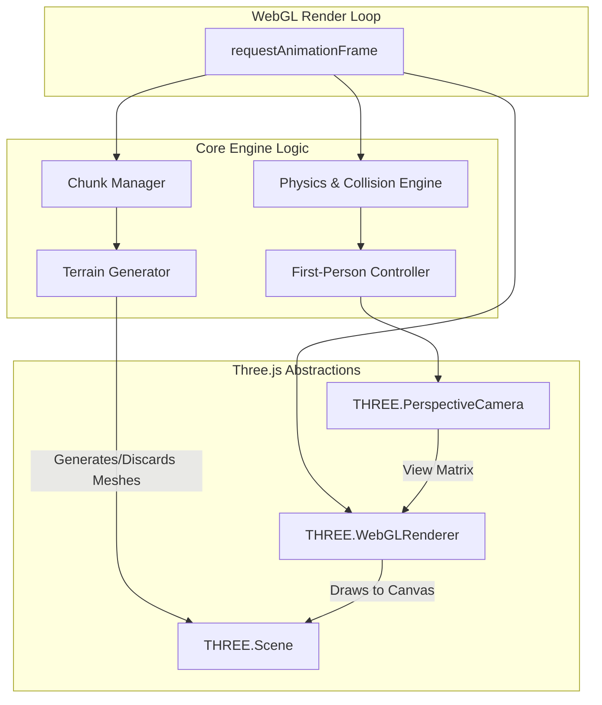

# Web Mine Craft ⛏️🧊

<div align="center">

**A high-performance, browser-native Minecraft clone engineered from scratch using vanilla Three.js and Vite. Experience infinite procedural terrain generation right in your browser.**

[](https://threejs.org/)
[](https://vitejs.dev/)
[](https://developer.mozilla.org/en-US/docs/Web/JavaScript)
[](https://vercel.com)
[](https://opensource.org/licenses/MIT)

[Features](#-key-features) • [Engine Architecture](#-3d-engine--architecture) • [Quick Start](#-quick-start)

</div>

---

## 📸 Project Media


*(Add screenshots of the infinite generated terrain, block placement, and lighting effects here)*

[Watch Demo Video](assets/demo.mp4)

---

## 🎯 Key Features

✅ **Infinite Procedural Generation** - A robust noise-based algorithm dynamically chunks and renders terrain endlessly as the player moves.  
✅ **Interactive Voxel Environment** - Raycasting technology enables users to break, place, and interact with blocks in a 3D coordinate space.  
✅ **Optimized Rendering Geometry** - Heavily optimized `InstancedMesh` and geometry merging ensure high frame rates (60+ FPS) even with thousands of active blocks.  
✅ **First-Person Physics & Collision** - Custom AABB (Axis-Aligned Bounding Box) collision detection keeping the player grounded and restricted by the environment geometry.  
✅ **Web Native & Zero Install** - Operates entirely in the browser using WebGL without any native application dependencies.

---

## 🏗 3D Engine & Architecture

`web-mine-craft` bypasses heavy framework wrappers (like React Three Fiber) in favor of a highly optimized, raw **Three.js** implementation.



### Technical Highlights:
- **Chunk Management**: The world is divided into discrete chunks. As the player crosses chunk boundaries, out-of-sight chunks are destroyed and removed from GPU memory, while new chunks are generated using Perlin/Simplex noise.
- **Lighting Model**: Implements realistic sun positioning using `DirectionalLight` and ambient occlusion shadows for block depth.
- **Vite Build System**: Ultra-fast asset compilation and local development server, optimized for deploying raw JS bundles directly to Vercel via `vercel.json`.

---

## 🚀 Quick Start

### Prerequisites
- **Node.js** (v18 or higher)
- **npm** or **yarn**
- **A WebGL2 Compatible Browser** (Chrome, Firefox, Safari, Edge)

### 1. Clone the Repository
```bash
git clone https://github.com/Sameer-Bagul/web-mine-craft.git
cd web-mine-craft
```

### 2. Install Dependencies
```bash
npm install
```

### 3. Start Development Server
```bash
npm run dev
```
*The WebGL context will launch immediately at `http://localhost:5173` with Hot Module Replacement (HMR).*

### 4. Build for Production
To bundle the Three.js assets and scripts for static hosting:
```bash
npm run build
```
*(The compiled assets will be available in the `/dist` directory, fully optimized for immediate Vercel deployment).*

---

## 🎮 Controls
- **W, A, S, D**: Move around the terrain.
- **Spacebar**: Jump.
- **Mouse Movement**: Look around (Pointer Lock API).
- **Left Click**: Break blocks.
- **Right Click**: Place blocks.

---

## 🤝 Contributing

Contributions to improve world generation, add new blocks, or optimize chunk loading are welcome!
1. Fork the repository
2. Create your feature branch (`git checkout -b feature/NewBiomes`)
3. Commit your changes
4. Push to the branch
5. Open a Pull Request

---

## 📝 License

This project is licensed under the MIT License.

<div align="center">
<b>Pushing the limits of the browser.</b>
</div>
